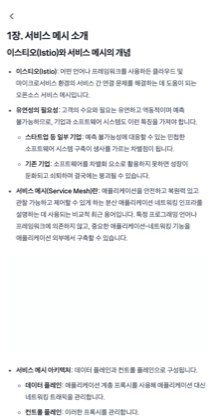
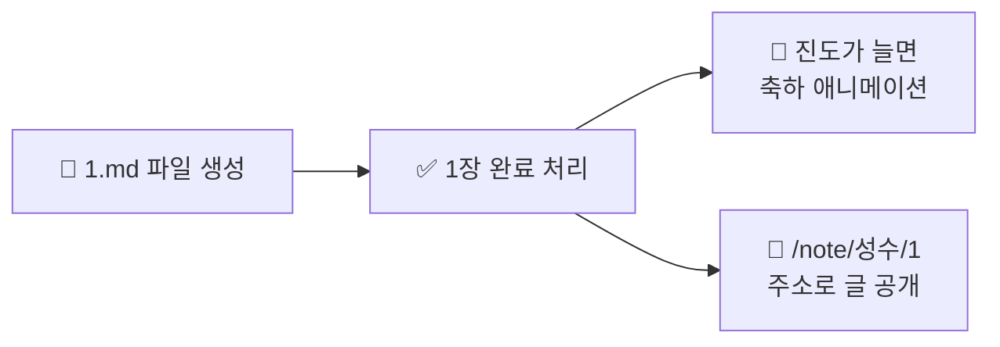

<div align="center">

# 📚 Dev Study Club

**같이 읽고, 각자 쓰고, 진도는 자동으로.**

마크다운 파일 하나만 만들면 됩니다. 나머지는 앱이 알아서 합니다.

[](https://github.com/dev-study-club/istio-in-action/actions/workflows/deploy.yml)
[](https://dev-study-club.github.io/istio-in-action/)




<sub>왼쪽: 내 진도 화면 &nbsp;·&nbsp; 오른쪽: 내가 쓴 노트</sub>

</div>

---

## 🚀 3분 만에 첫 노트 쓰기

1장을 다 읽었다고 해봅시다. **파일 하나만 만들면 끝입니다.**

```bash
# 1. 내 폴더에 "장번호.md" 파일을 만든다
mkdir -p content/istio-in-action/성수
echo "# 1장 정리" > content/istio-in-action/성수/1.md

# 2. 내용을 채우고 커밋한다
git add . && git commit -m "docs: 성수 1장 노트" && git push
```

몇 분 뒤 배포가 끝나면:

- 진도 화면의 **1장 동그라미에 체크가 들어옵니다** ✅
- 그 동그라미를 누르면 **내 글이 열립니다**

> **왜 체크박스가 없나요?**
> 파일이 있으면 그 장을 끝낸 것으로 봅니다. 따로 체크할 곳이 없습니다.

---

## 🗺️ 어떤 파일이 화면 어디가 되나

```
content/istio-in-action/
├── members.json      →  사람 선택 화면의 카드
├── chapters.md       →  챕터·절 제목
├── schedule.md       →  모두의 기본 일정
└── 성수/
    ├── schedule.md   →  성수만의 일정 (있으면 기본 일정보다 우선)
    ├── 1.md          →  1장 노트 + "1장 완료" 표시
    └── 2.md          →  2장 노트 + "2장 완료" 표시
```



---

## 📝 하고 싶은 일 찾기

| 하고 싶은 일        | 고칠 파일                                    |
| ------------------- | -------------------------------------------- |
| 노트 쓰기           | `content/istio-in-action/<이름>/<장번호>.md` |
| 챕터·절 제목 바꾸기 | `content/istio-in-action/chapters.md`        |
| 일정 바꾸기         | `content/istio-in-action/schedule.md`        |
| 나만 다른 속도로    | `content/istio-in-action/<이름>/schedule.md` |
| 사람 추가하기       | `content/istio-in-action/members.json`       |

---

## 1. 노트 쓰기

파일 이름은 **장번호만** 씁니다. `1.md`, `2.md` 이런 식입니다.

```
content/istio-in-action/성수/1.md   ← 성수가 1장을 끝냈다
```

### 쓸 수 있는 것

평소 쓰던 마크다운 그대로입니다. 제목, 목록, 표, 인용, 코드 블록, 링크 전부 됩니다.

````markdown
## 핵심 개념

- **서비스 메시**: 네트워킹 관심사를 인프라로 옮긴다
  - 사이드카 프록시가 트래픽을 가로챈다

> 클라우드에서는 인프라가 일시적이라는 가정으로 앱을 만든다

| 패턴          | 하는 일                           |
| ------------- | --------------------------------- |
| 서킷 브레이커 | 오동작하는 서비스에 부하를 끊는다 |

```bash
istioctl install --set profile=demo -y
```

[Istio 공식 문서](https://istio.io)
````

### 이미지 넣기

이미지 파일은 `public/images/notes/istio-in-action/`에 넣습니다.
글에서는 **`images/`부터 시작하는 경로**를 씁니다.

```markdown

```

파일 이름은 `<장번호>-<순번>.png`처럼 지어주세요. 나중에 찾기 쉽습니다.

> 💡 크기를 따로 안 적어도 됩니다. 빌드할 때 자동으로 넣어줘서 글이 밀리지 않습니다.

### 알아두면 좋은 것

- 노트는 **포맷 검사를 받지 않습니다.** 들여쓰기나 줄바꿈을 편한 대로 쓰세요.
- `<script>` 같은 걸 넣어도 화면에 나오기 전에 걸러집니다. 안전합니다.
- 노트를 안 써도 진도 화면은 멀쩡히 돌아갑니다.

---

## 2. 챕터·절 제목 — `chapters.md`

진도 화면의 챕터 이름과 노트 화면의 제목이 여기서 나옵니다.
**같은 책을 함께 읽으니 파일은 하나면 됩니다.** 사람별로 복사하지 마세요.

```markdown
# Istio in Action 학습 진도

## 1장. 서비스 메시 소개

- [ ] 1.1 더 빨리 가려 할 때 마주치는 어려움
- [ ] 1.2 애플리케이션 라이브러리로 해결하기
```

- `## `로 시작하는 줄 → **챕터**
- `- [ ] `로 시작하는 줄 → **절**

체크 표시(`[ ]` / `[x]`)는 **손대지 않아도 됩니다.** 완료 여부는 노트 파일이 있는지로 정해집니다.

---

## 3. 일정 바꾸기 — `schedule.md`

표만 고치면 날짜에 맞춰 "오늘의 퀘스트"가 바뀝니다.

```markdown
| 기간                    | 챕터 | 소주제                   |
| ----------------------- | ---- | ------------------------ |
| 2026-07-13 ~ 2026-07-19 | 1, 2 | 서비스 메시와 Istio 시작 |
| 2026-07-20 ~ 2026-07-26 | 3, 4 | 데이터 플레인            |
```

**규칙 세 가지**

| 항목 | 형식                 | 예시                             |
| ---- | -------------------- | -------------------------------- |
| 날짜 | `YYYY-MM-DD`         | `2026-07-13`                     |
| 챕터 | 쉼표로 **하나 이상** | `7` · `1, 2` · `1, 2, 3, 4`      |
| 기간 | 서로 **겹치지 않게** | 겹치는 날엔 뒤쪽 주차만 잡힙니다 |

> ⚠️ 형식이 어긋나면 **에러 화면이 뜹니다.**
> 그 줄만 조용히 건너뛰면 한 주가 소리 없이 사라지는데, 아무도 눈치채지 못합니다.
> 시끄럽게 실패하는 쪽을 택했습니다.

### 나만 다른 속도로 가기

사람마다 속도가 다를 수 있습니다. **내 폴더에 `schedule.md`를 두면 그게 우선합니다.**

```
content/istio-in-action/
├── schedule.md        ← 기본 (이 파일이 없는 사람은 이걸 따름)
└── 채영/
    └── schedule.md    ← 채영은 이걸 따름
```

이번 주에 1~4장을 몰아서 따라잡고 싶다면 이렇게 씁니다.

```markdown
| 기간                    | 챕터       | 소주제            |
| ----------------------- | ---------- | ----------------- |
| 2026-08-05 ~ 2026-08-11 | 1, 2, 3, 4 | 처음부터 따라잡기 |
| 2026-08-12 ~ 2026-08-18 | 5, 6       | 트래픽 제어       |
```

내 폴더에 이 파일이 없으면 자동으로 기본 일정을 따릅니다. 굳이 만들 필요 없습니다.

---

## 4. 사람 추가하기 — `members.json`

```json
[{ "name": "성수", "avatar": "avatars/성수.webp" }]
```

배열에 적은 순서가 화면에 보이는 순서입니다. **두 가지만 하면 됩니다.**

1. `members.json`에 이름과 아바타 경로를 추가
2. `public/avatars/<이름>.webp` 이미지를 넣기 — **1000px 16:9**로 준비하세요

> 💡 PNG로 받았다면 이렇게 바꾸세요. 화질은 그대로인데 용량이 1/4이 됩니다.
>
> ```bash
> cwebp -q 82 성수.png -o 성수.webp
> ```

노트 폴더는 첫 노트를 쓸 때 만들면 됩니다. 미리 만들어둘 필요 없습니다.

---

<details>
<summary><b>📖 책(스터디) 추가하기 — 아직 안 됩니다</b></summary>

<br>

폴더 구조는 책을 여러 권 담을 수 있게 잡혀 있지만, **앱은 아직 한 권만 봅니다.**
`src/services/content.ts`의 `BOOK` 상수가 `'istio-in-action'`으로 고정이고, 책을 고르는 화면도 주소도 없습니다.

`content/` 아래에 폴더를 더 만들면 화면에는 아무것도 안 나오고, 파일만 빌드에 딸려 들어가 **용량이 커집니다.**

새 책을 열려면 세 가지가 필요합니다.

1. `BOOK` 상수를 함수 파라미터로 바꾸기
2. 책 선택 화면 만들기
3. 주소 체계에 책 이름 넣기

</details>

<details>
<summary><b>⚠️ 알려진 제약</b></summary>

<br>

**공유 링크 미리보기가 구분되지 않습니다.**
노트는 `/note/<이름>/<장번호>`라는 자체 주소를 갖지만, 모든 화면이 같은 `<title>`을 쓰고 `description`·OG 태그가 없습니다. 슬랙이나 카톡에 붙여넣으면 어느 노트인지 알 수 없습니다.

**일정표에 없는 챕터는 진도 화면에 안 나옵니다.**
진도 화면은 `schedule.md`의 주차를 훑어 그립니다. `chapters.md`에만 있고 일정에 없는 챕터(예: 부록)는 주소로 직접 들어가야 열립니다.

</details>

<details>
<summary><b>🛠️ 개발자용 — 로컬에서 돌려보기</b></summary>

<br>

```bash
pnpm install
pnpm dev          # http://localhost:5173
```

커밋 전에 확인하는 것들입니다. CI에서도 같은 걸 돌립니다.

```bash
pnpm lint         # ESLint
pnpm format:check # Prettier
pnpm knip         # 안 쓰는 코드 찾기
pnpm test         # Vitest
pnpm build        # 타입 검사 + 프로덕션 빌드
```

</details>

---

<div align="center">
<sub>글은 전부 <code>content/</code> 안에 있습니다. push하면 GitHub Actions가 알아서 배포합니다.</sub>
</div>
