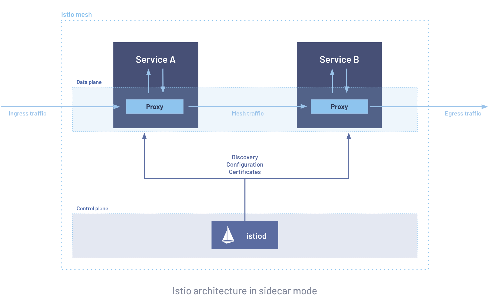
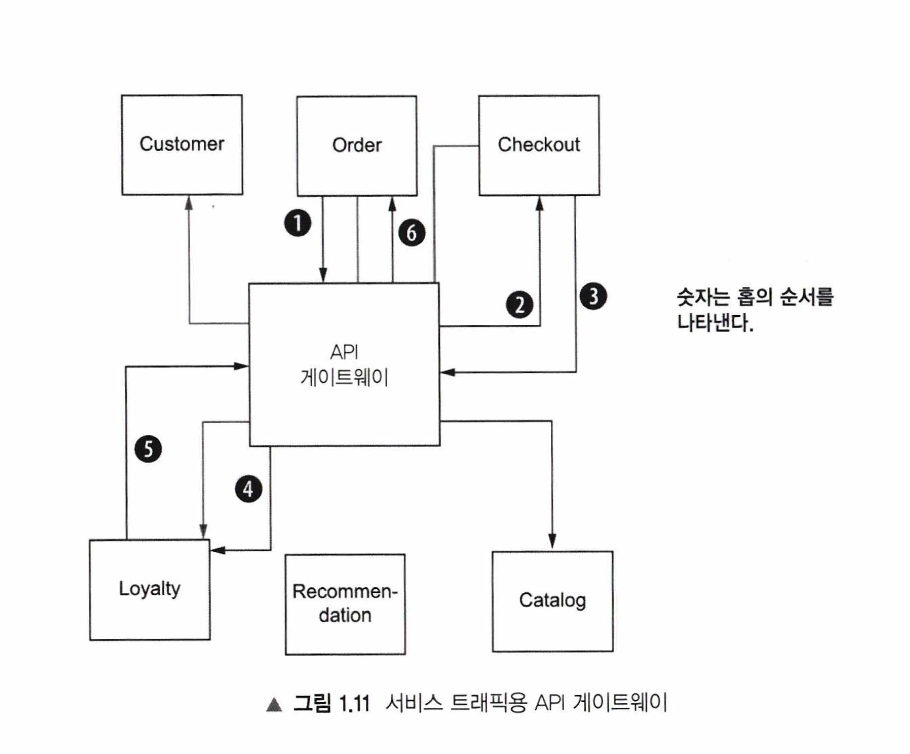
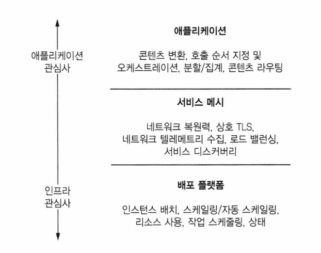

# 1 서비스 메시 소개하기
- 서비스 메시로 서비스 지향 아키텍처 문제 해결하기
- 이스티오의 개요와 이스티오가 마이크로서비스 문제 해결을 돕는 방법 알아보기
- 서비스 메시와 이전 기술 비교하기

> 서비스 메시란 ? 
> - 애플리케이션을 안전하고 복원력 있고 관찰 가능하고 제어할 수 있게 하는 분산 애플리케이션 네트워킹 인프라
> - 데이터 플레인과 컨트롤 플레인으로 구성된 아키텍처

서비스 메시 :마이크로서비스들 사이의 네트워크 통신을 애플리케이션 코드 밖에서 관리해주는 전용 인프라 계층

서비스 메시가 필요한 이유 ? ?
데이터 플레인은 애플리케이션 계층 프록시를 사용해 애플리케이션 대신 네트워킹 트래픽을 관리하고 컨트롤 플레인은 프록시를 관리함.

용어 이해하기!
애플리케이션 계층 프록시  =  L7(7계층) 프록시  =  서비스 프록시  =  Envoy(엔보이)  =  사이드카 프록시

클라우드는 신뢰할 수 없다 -> 클라우드에서는 인프라가 일시적이며, 간혹 사용할 수 없다는 가정 아래 앱을 구축해야함 
이런 일시성에서는 아키텍처를 신뢰해야함.

### 1.1.2 서비스 상호작용을 복원력 있게 만들기
#### 복원력있는 시나리오를 위해 발전한 패턴

> 패킷 대신 메시지 수준에서 동작

- 클라이언트 측 로그밸런싱
- 서비스 디스커버리
- 서킷 브레이커
- 격벽
- 타임아웃
- 재시도
- 재시도 예산
- 데드라인

### 1.1.3 일어나고 있는 일 실시간으로 이해하기
- 어떤 서비스가 서로 통신하고 있는지
- 일반적인 서비스 부하가 어떤 형태인지
- 예상하는 오동작 수는 어느 정도인지
- 서비스 오동작 시 어떤 일이 일어나는지
- 서비스 상태가 어떤지 등 서비스 아키텍처를 아는 것은 대단히 중요함

시스템 붕괴전에 실제 상황을 충분히 파악하고 있다고 확신하려면 메트릭, 로그, 트레이스로 시스템을 관찰하는 것은 서비스 아키텍처 운영에서 매우 중요한 부분이다.

## 1.2 애플리케이션 라이브러리로 위 문제를 해결해보기
많은 기업들이 자사의 마이크로서비스 라이브러리를 오픈소스로 공개함.

단점은 기술스택에 따라 매번 애플리케이션 코드 딴에서 다른 라이브러리를 도입해야하는 번거로움이 있다는점. 

## 1.3 이런 관심사를 인프라에 전가하기

사용하기로 한 모든 언어마다 구현하려고 막대한 시간과 자원을 투자하는 것은 시간 낭비. 자체적으로 애플리케이션이 처리해야 하는 부담을 덜어주는 방법이 인프라에서 처리하는 방법
### 1.3.1 애플리케이션 인식 서비스 프록시
- 애플리케이션을 인식할 수 있고, 서비스를 대신해 애플리케이션 네트워킹을 수행하는 프록시
- 서비스 프록시는 커넥션과 패킷을 이해하는 전통적 인프라 프록시와 달리 메시지와 요청 같은 애플리케이션 구조를 이해한다.-> 7계층 프록시가 필요하다.

### 1.3.2 엔보이 프록시 만나기
프록시 관심사 -> 엔보이!
엔보이 : 오픈소스 생태게에서 다재다능하고 성능이 뛰어난 애플리케이션 수준 프록시로 부각된 서비스 프록시
- 엔보이 같은 서비스 프록시는 애플리케이션의 모든 인스턴스와 함께 단일 최소 단위 single atomic unit로 배포할 수 있다.
- 사이드카 배포는 기능을 제공하기 위해 메인 애플리케이션 프로세스와 협력하는 추가 프로세스이다.

참고 : https://www.envoyproxy.io/docs/envoy/latest/intro/what_is_envoy

## 1.4 서비스 메시란 무엇인가??
서비스 메시(Service Mesh)란? 애플리케이션 대신 프로세스 외부에서 투명하게 네트워크 트래픽을 처리하는 분산형 애플리케이션 인프라

- 데이터 플레인이 행동하는 역할, 컨트롤 플레인이 정의하는 역할

## 1.5 이스티오 서비스 메시 소개


## 네트워크 계층 먼저 이해하기
> 네트워크를  편지 배달 시스템으로 두고 이해하기

|계층 | 이름| 영역 | 편지 발송 시스템 | 다루는 도구(?)|
|----|----|---|-----|------|
|L3|네트워크| IP 주소, 패킷| 편지 배송 주소| 라우터|
|L4| 전송| 포트, 커넥션(TCP/UDP)| 편지 도착 위치 - 정문 말고 3번 출입구로 전달해주세요| L4 로드밸런서|
|L7 | 애플리케이션 | HTTP 내용, 요청| 어떤 역할을 해야하는 건지? 주문서네, 도시가스 내역이네 등등 | niginx, Envoy|

- 패킷(packet) = 데이터를 잘게 쪼갠 조각. 큰 파일도 작은 조각들로 나눠서 보냄. L3는 이 조각을 "어느 IP로 보낼지"만 봄
- 커넥션(connection) = 두 컴퓨터가 TCP 3-way handshake 유지하는 통로. L4는 "이 커넥션이 포트 443으로 가는 TCP구나"까지만 봄
- L3·L4 프록시는 내용물을 보지않음 -> HTTP GET /orders, 쿠키, 헤더는 알 수 없음
- 내용물을 알 수 있는거 L7 
- 리버스 프록시(reverse proxy) = 클라이언트 요청을 대신 받아서 뒤에 숨어있는 여러 서버 중 하나로 넘겨주는 중개자.


( 반대로 포워드 프록시라는 것도 있음 )
- 회사에서 직원들 인터넷 접속이 다 거쳐가는 회사 프록시 -> 유해사이트 차단하는 역할을 함
- Envoy는 xDS로 실시간으로 설정을 받아 무중단으로 바꿈. (nginx와 다른점은 reload 없이 동적으로 (무중단) 설정을 바꿀 수 있다는 점)
- HAProxy는 설정에 모드가 있음
  - mode tcp   → L4로 동작 (봉투 안 열고 커넥션만 분배)
  - mode http  → L7으로 동작 (봉투 열어서 HTTP 내용 보고 판단)

## envoy 를 여러 이름으로 바꿔서 부르는 이유
```bash
Envoy (제품 이름, 고정)
 ├─ 역할이 L7 처리라서    → "애플리케이션 계층 프록시" / "L7 프록시"
 ├─ 파드에 붙는 방식이라서 → "사이드카 프록시"
 └─ 메시 전체로 묶어 부르면 → "데이터 플레인"
```

## node js의 라이브러리
```bash
┌──────────────┬───────────────────────────────────┐
│     기능     │        Node.js 라이브러리         │
├──────────────┼───────────────────────────────────┤
│ 메트릭       │ prom-client                       │
├──────────────┼───────────────────────────────────┤
│ 트레이싱     │ OpenTelemetry (@opentelemetry/*), │
│              │  예전엔 Jaeger/Zipkin 클라이언트  │
├──────────────┼───────────────────────────────────┤
│ 로깅         │ pino, winston                     │
├──────────────┼───────────────────────────────────┤
│ 서킷         │ opossum, cockatiel                │
│ 브레이커     │                                   │
├──────────────┼───────────────────────────────────┤
│ 서비스       │ 표준이 없음 (consul 클라이언트 등 │
│ 디스커버리   │  직접 조합)                       │
└──────────────┴───────────────────────────────────┘
```
## 용어로 이해해보기
- API Gateway (= Istio의 Ingress Gateway)
- 서비스 메시(사이드카들)
- 데이터 플레인 = 행동하는 주체 + 그 행동 자체. 실제로 트래픽을 나르고·암호화하고·재시도하는 Envoy들의 집합 (근육)
-  컨트롤 플레인 = 규칙을 정하고 나눠주는 주체. "이렇게 동작해"라고 정의해서 데이터 플레인에 배포하는 istiod. (두뇌)
- 컨트롤 플레인은 클러스터 전체에 1개(중앙 집중 방식)
```bash
                    istiod (1개, 중앙)
                   ╱    │    ╲          ← xDS로 설정 배포 (1 : 다수)
                  ╱     │     ╲
            [Envoy]  [Envoy]  [Envoy]   ← 파드마다 1개씩 (다수)
             파드1    파드2    파드3
```
- 컨트롤 플레인 전체에 장애가 발생하더라도 데이터 플레인은 (이미 받아둔 설정으로) 계속 동작함

## 요약하자면
- [네트워크 계층]  L3=IP/패킷, L4=포트/커넥션(봉투 안 봄), L7=HTTP 내용(봉투 열어봄)
- [리버스 프록시]  손님 요청을 대신 받아 뒤 서버로 분배 (nginx/HAProxy/Envoy)
- [Envoy]         동적 설정 가능한 L7 리버스 프록시 = "애플리케이션 계층 프록시" = 사이드카 = 데이터플레인
- [사이드카]       파드 안에 앱과 함께 든 Envoy 컨테이너 (없어도 통신은 됨, 기능만 얹는 것)
- [라이브러리 시대] Netflix OSS(Java)·opossum(node)... 언어마다 재발명 → 관리비용↑ = 서비스메시 아님
- [서비스 메시]    그 관심사를 프로세스 밖 프록시(인프라)로 옮긴 것 = 언어 무관 = Istio
- [데이터 플레인]  파드마다 붙은 프록시들의 집합 (근육, 행동) — 분산
- [컨트롤 플레인]  istiod 1개가 클러스터 전체 프록시를 관리 (두뇌, 규칙) — 중앙

## 관심사를 인프라로 넘겼을때 담당하는 부분 (매핑표)
```bash
┌─────────────────┬───────────────┬──────────────────┐
│     관심사      │  라이브러리   │ Istio (인프라,   │
│                 │ 시대 (앱 안)  │      앱 밖)      │
├─────────────────┼───────────────┼──────────────────┤
│                 │               │ Envoy가 자동     │
│ 메트릭          │ prom-client   │ 수집 →           │
│                 │ 등            │ Prometheus가     │
│                 │               │ 긁어감           │
├─────────────────┼───────────────┼──────────────────┤
│                 │ OpenTelemetry │ Envoy가 span     │
│ 트레이싱        │  SDK          │ 생성 →           │
│                 │               │ Jaeger/Zipkin    │
├─────────────────┼───────────────┼──────────────────┤
│ 로깅(액세스     │ winston/pino  │ Envoy access log │
│ 로그)           │               │                  │
├─────────────────┼───────────────┼──────────────────┤
│ 서킷 브레이커   │ opossum(Java: │ DestinationRule  │
│                 │  Hystrix)     │ (YAML로 설정)    │
├─────────────────┼───────────────┼──────────────────┤
│ 재시도/타임아웃 │ 앱 코드       │ VirtualService   │
│                 │               │ (YAML)           │
├─────────────────┼───────────────┼──────────────────┤
│ 로드밸런싱      │ Ribbon        │ Envoy가 처리     │
├─────────────────┼───────────────┼──────────────────┤
│ 서비스          │ Eureka        │ istiod가 처리    │
│ 디스커버리      │               │                  │
├─────────────────┼───────────────┼──────────────────┤
│ mTLS 암호화     │ 앱에서 TLS    │ Envoy가 자동     │
│                 │ 설정          │                  │
└─────────────────┴───────────────┴──────────────────┘
```

### 트레이싱 파이프라인 3단계 이해하기

```bash

[1. 생성/수집]          [2. 전송/가공]           [3. 저장/시각화]
누가 span을 만드나?  →  어디로 실어나르나?   →   어디에 쌓고 화면으로 보나?
OpenTelemetry SDK       OTel Collector           Jaeger / Zipkin
(또는 Envoy가 대신)                              (백엔드 = 저장+UI)
```
옛날엔 "Jaeger 클라이언트 라이브러리", "Zipkin 클라이언트 라이브러리"로 각각 계측했어. 이제 그건 OpenTelemetry SDK로 통일됨.

### 라이브러리별 역할 한눈에 보기
```bash
┌────────────┬────────────────────────────┬──────────┐
│    도구    │            역할            │   단계   │
├────────────┼────────────────────────────┼──────────┤
│ OpenTeleme │ 텔레메트리(트레이스·메트릭 │ 만드는   │
│ try        │ ·로그) 생성·수집 표준      │ 쪽       │
├────────────┼────────────────────────────┼──────────┤
│ Jaeger /   │ 트레이스 저장 + 시각화     │ 보는 쪽  │
│ Zipkin     │ 백엔드                     │          │
├────────────┼────────────────────────────┼──────────┤
│ Fluentd /  │ 로그 수집·전송             │ 나르는   │
│ Fluent Bit │                            │ 쪽(로그) │
├────────────┼────────────────────────────┼──────────┤
│ Prometheus │ 메트릭 저장 + 조회         │ 보는 쪽( │
│            │                            │ 메트릭)  │
└────────────┴────────────────────────────┴──────────┘
```

### Envoy 로드밸런싱 = ALB,  같은 계층(L7), 다른 위치
```bash
┌─────────────┬────────────────────┬─────────────────┐
│             │      AWS ALB       │  Envoy (Istio   │
│             │                    │    사이드카)    │
├─────────────┼────────────────────┼─────────────────┤
│ 계층        │ L7                 │ L7              │
├─────────────┼────────────────────┼─────────────────┤
│ 위치        │ 클러스터           │ 파드마다(내부,  │
│             │ 입구(엣지, 남북)   │ 동서)           │
├─────────────┼────────────────────┼─────────────────┤
│             │ 보통               │ 파드            │
│ 개수        │ **하나(중앙)**를   │ 수만큼(분산)    │
│             │ 공유               │                 │
├─────────────┼────────────────────┼─────────────────┤
│ 관리        │ AWS가              │ 네가/Istio가    │
│             │ 관리(managed)      │ 관리            │
├─────────────┼────────────────────┼─────────────────┤
│ 로드밸런싱  │ 손님이 들어올 때   │ 서비스 A가 B를  │
│ 시점        │                    │ 부를 때         │
└─────────────┴────────────────────┴─────────────────┘
```
- 담당 계층은 같음(L7)
- AWS엔 **NLB(Network Load Balancer)**가 있는데 그게 L4짜리야 — 아까 HAProxy tcp모드 같은 역할.
- 핵심 차이: ALB는 "입구에 선 큰 문지기 하나", Envoy는 "모든 서비스 옆에 붙은 작은 문지기들". 그래서 Envoy는 서비스 간(A→B) 로드밸런싱을 할 수 있음
- ALB는 보통 입구 트래픽(클러스터?)만 봄 
- 관측성 도구 참고 : Grafana(화면) + Prometheus(메트릭) + Loki(로그) + Tempo(트레이스) = Grafana 진영의 관측성 풀세트

## 참고
- iptables가 envoy로 데이터를 가로채는 역할을함(transparent)
- iptables 심는 일을 istio-init 컨테이너 (파드마다 특권 컨테이너)가 하기도 하고, Istio CNI 플러그인 (네트워크 셋업 단계에서 처리)이 하기도함.
### Istio가 정해둔 고정 기본 포트값
```bash
┌─────────────┬───────────────────────────────────────┐
│    포트     │                 용도                  │
├─────────────┼───────────────────────────────────────┤
│ 15001       │ outbound (나가는 트래픽) Envoy가 받는 │
│             │  포트                                 │
├─────────────┼───────────────────────────────────────┤
│ 15006       │ inbound (들어오는 트래픽) Envoy가     │
│             │ 받는 포트                             │
├─────────────┼───────────────────────────────────────┤
│ 15000       │ Envoy admin API                       │
├─────────────┼───────────────────────────────────────┤
│ 15020/15021 │ 헬스체크·상태                         │
├─────────────┼───────────────────────────────────────┤
│ 15090       │ Envoy 메트릭(Prometheus용)            │
└─────────────┴───────────────────────────────────────┘
```

- UID 1337 예외 -> 이미 iptables가 가로챈 요청 예외처리는 iptables 자체 설정(iptables의 규칙), istio가 정해진 규칙으로 처리
- 관측성
- OpenTelemetry 히스토리 간단하게 알아보기: OpenTracing(트레이스 API) + OpenCensus(트레이스+메트릭)가 서로 경쟁하며 개발자를 혼란시키자 → 2019년 OpenTelemetry로 합병 → 벤더별 클라이언트(Jaeger/Zipkin client)는 2022년경 폐기되고 계측은 OTel SDK로 통일. 단, Jaeger/Zipkin "백엔드"는 여전히 현재도 사용되는 편

### 1.5.1 서비스 메시 vs ESB (엔터프라이즈 서비스 버스)
ESB란 ?  2000년대 SOA 시대의 "중앙 통합 서버"

esb와 서비스 메시 차이

```bash
┌────────────┬─────────────────────────────┬──────────────────────────────────┐
│            │         ESB (옛날)          │       서비스 메시 (Istio)        │
├────────────┼─────────────────────────────┼──────────────────────────────────┤
│ 위치       │ 중앙 집중 (한 덩어리)       │ 분산 (프록시가 각 앱 옆에)       │
├────────────┼─────────────────────────────┼──────────────────────────────────┤
│ 문제       │ 중앙이라 병목·단일 장애점,  │ 분산이라 병목 없음               │
│            │ 사일로화                    │                                  │
├────────────┼─────────────────────────────┼──────────────────────────────────┤
│ 범위       │ 네트워킹 + 비즈니스         │ 오직 네트워킹만 (비즈니스 로직   │
│            │ 로직까지 뒤섞음             │ 안 건드림)                       │
├────────────┼─────────────────────────────┼──────────────────────────────────┤
│ 소프트웨어 │ 복잡한 독점 벤더 제품       │ 오픈소스                         │
└────────────┴─────────────────────────────┴──────────────────────────────────┘
```

### 1.5.2 서비스 메시와 API 게이트웨이의 관계

API 게이트웨이의 역할
- 공개 API에 보안, 속도 제한, 할당량 관리, 메트릭 수집 기능 제공
- API 계획 명세, 사용자 등록, 요금 청구와 기타 운영 문제를 포함하는 전반적 API 관리 솔루션에 공개 API 를 연결하는 것
```bash
리버스 프록시 (큰 우산)
   └── API 게이트웨이 (리버스 프록시 + 인증·API키·rate limit·API 관리를 얹은 특수 버전)
```


그래프의 모든 서비스에서 홉hop이 두 번을 거치게 됨. 한번은 게이트웨이를 향하고 한 번은 실제 서비스로 향함. 
이는 네트워크 오버헤드와 지연 시간뿐 아니라 보안에도 영향을 미친다.
이런 다중 홉 아키텍처에서는 애플리케이션 관여 없이 API 게이트웨이가 단독으로 전송 메커니즘을 보호할 수 없다.

## 관측성을 비용관점으로 접근해보자.
```bash
┌────────────────┬────────────────────────┬───────────┐
│   비용 요소      │          설명          │   크기    │
├────────────────┼────────────────────────┼───────────┤
│                │ 사이드카 Envoy,        │           │
│ CPU/메모리      │ Collector,           │ 중간      │
│                │ Prometheus가 리소스    │           │
│                │ 소모                   │           │
├────────────────┼────────────────────────┼───────────┤
│                │ 메트릭·로그·트레이스를 │           │
│ 저장(스토리지) │  오래 보관할수록       │ 제일 큼   │
│                │ 디스크 ↑               │           │
├────────────────┼────────────────────────┼───────────┤
│ 네트워크       │ 스크레이핑·트레이스    │ 작음~중간 │
│                │ 전송 트래픽            │           │
└────────────────┴────────────────────────┴───────────┘
```
Loki=로그, Prometheus=메트릭

```bash
┌────────┬─────────────────────┬───────────────┬────────────────────────────┐
│        │  메트릭 (Metrics)   │  로그 (Logs)  │     트레이스 (Traces)      │
├────────┼─────────────────────┼───────────────┼────────────────────────────┤
│        │ 숫자(시간에 따른    │ 텍스트        │ 요청 하나의 여정(서비스 간 │
│ 정체   │ 측정값)             │ 기록(사건     │  이동 경로)                │
│        │                     │ 하나하나)     │                            │
├────────┼─────────────────────┼───────────────┼────────────────────────────┤
│        │                     │ "14:03        │                            │
│ 예시   │ "초당 요청 500건,   │ user=42 결제  │ "이 주문 요청:             │
│        │ 에러율 2%, CPU 70%" │ 실패: 카드    │ A(20ms)→B(310ms)→C(8ms)"   │
│        │                     │ 거절"         │                            │
├────────┼─────────────────────┼───────────────┼────────────────────────────┤
│ 답하는 │ "뭔가 잘못됐나?"    │ "정확히 무슨  │ "어디서 느려졌나/막혔나?"  │
│  질문  │ (전체 건강 상태)    │ 일이 있었나?" │ (병목 위치)                │
│        │                     │  (상세 사건)  │                            │
├────────┼─────────────────────┼───────────────┼────────────────────────────┤
│ 저장소 │ Prometheus/Mimir    │ Loki          │ Jaeger/Tempo               │
├────────┼─────────────────────┼───────────────┼────────────────────────────┤
│ 크기   │ 작음(숫자)          │ 큼(텍스트     │ 중간(샘플링)               │
│        │                     │ 대량)         │                            │
└────────┴─────────────────────┴───────────────┴────────────────────────────┘
```

책에서 이야기하는 서비스 메시의 성숙도

> 서비스 메시가 성숙하면 API 게이트웨이 기능도 메시 위에 얹혀서, 별도 게이트웨이가 필요 없어질것이다?

### 1.5.3 마이크로서비스가 아닌 아키텍처에도 이스티오를 사용할 수 있는가?
-  Istio는 애플리케이션 외부에서 작동하므로 기존 레거시 혹은 브라운 필드 환경에서도 배포해 메시에 통합할 수 있음
- 이스티오와 애플리케이
션 둘 다 서킷 브레이커 같은 기능을 중복으로 구현했더라도, 더 제한적인 정책이 효과를
발휘해 모든 게 정상적으로 잘 작동할 것이므로 안심할 수 있다. 시간 초과 및 재시도가 있
는 시나리오에서는 충돌이 발생할 수 있지만, 이스티오를 사용하면 운영 환경에 나가기 전
에 서비스를 테스트해 충돌을 찾아낼 수 있다.

### 1.5.4 이스티오가 분산 아키텍처에 적합한 경우
- Istio = 중간 연결 조직
- Istio가 하는 역할 네트워크 복원력, mTLS, 텔레메트리, 로드밸런싱, 콘텐츠 기반 라우팅(HTTP 헤더로), 보안 토큰 검증, 할당량 정책
- 클라우드 아키텍처에서 관심사를 이상적으로 분리하는 방법


### 1.5.5 서비스 메시를 사용할 때의 단점

> 서비스 메시는 복원력·보안·관측성을 얻는 대신 지연·리소스·복잡성이라는 값을 치른다.

1. 서비스 메시를 사용하면 요청 경로에 미들웨어(프록시 등)가 추가됨
2. 테넌시에 대한 적절한 정책, 자동화, 세심한 고려 없이 메시를 잘못 설정해 여러 서비스에 영향을 미치는 상황이 발생할 수 있음 ( 격리·정책을 잘못 설정하면 한 실수가 여러 서비스에 영향을 미침)
3.  새로운 계층 = 복잡성 증가
  - 서비스 메시는 요청 경로에 위치하기 때문에 서비스 및 애플리케이션 아키
텍처의 매우 중요한 요소가 됨
  - 메시가 요청 경로의 핵심 요소가 되니까, 보안·관측성·라우팅을 개선할 기회도 크지만 운영·거버넌스 복잡도도 같이 늘어남. "이걸 어떻게 설정·운영하고 기존 조직 절차에 녹일지"가 새 숙제가 됨

