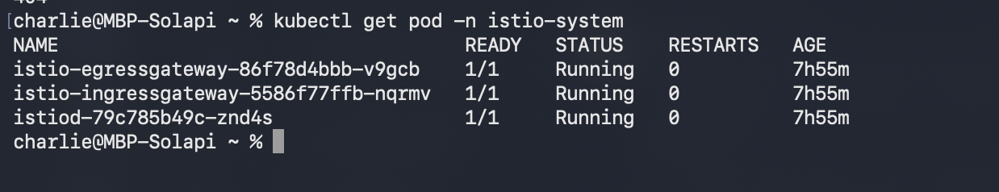
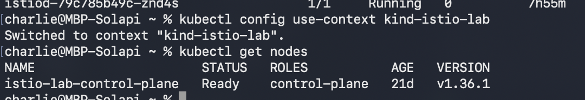
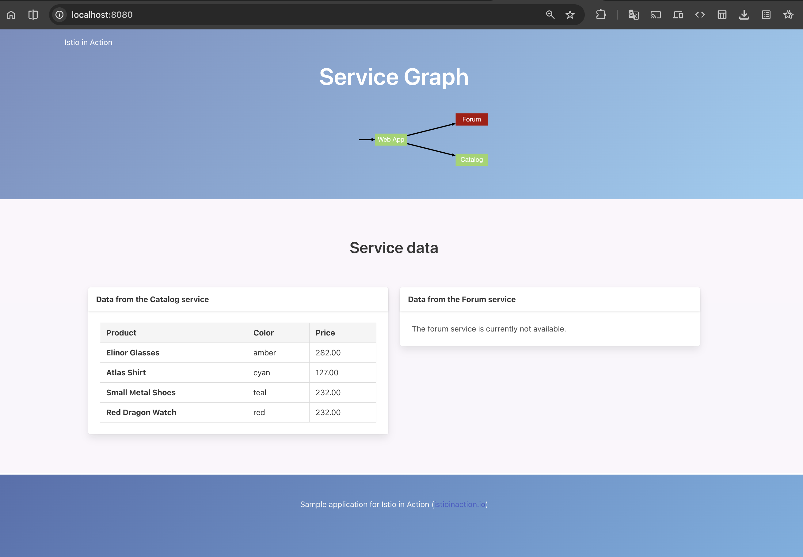
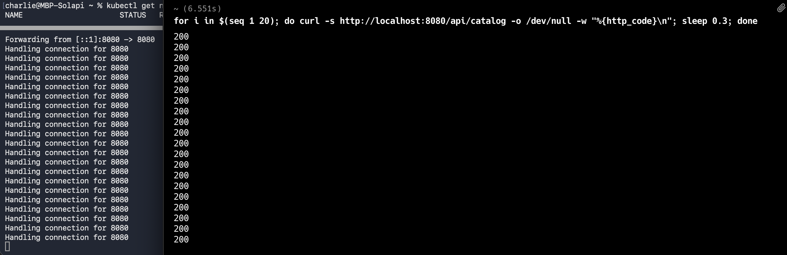
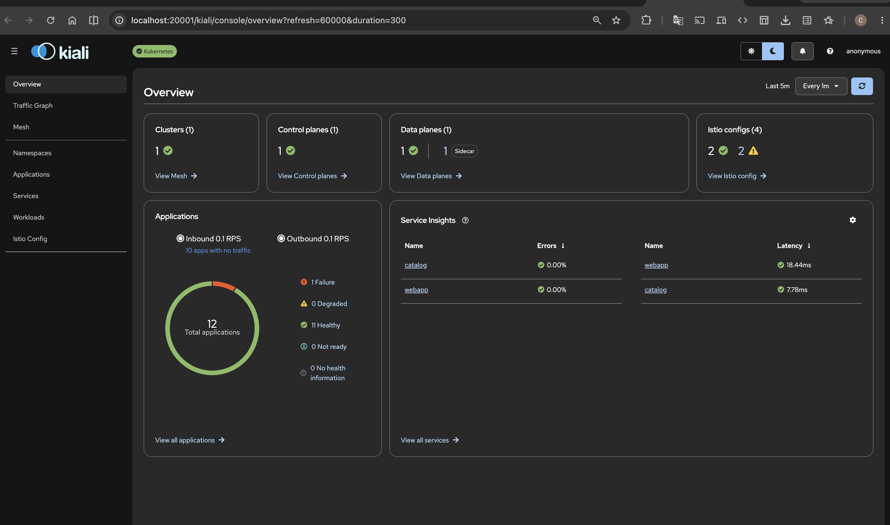
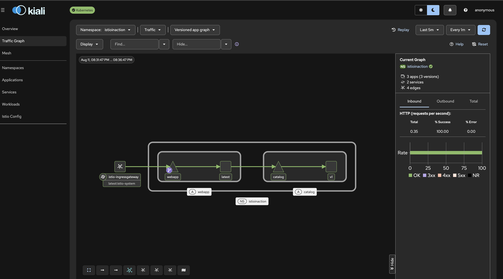
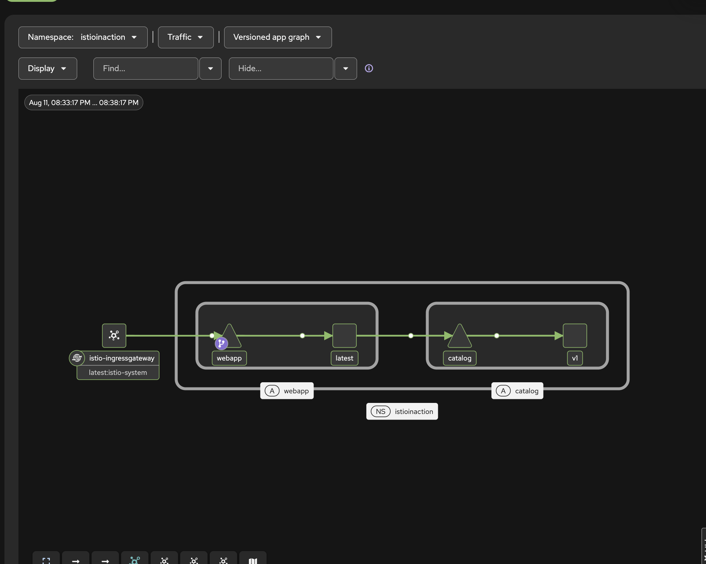

# 2 이스티오 첫걸음

> 진도 정리
> ① Istio 설치
> ② 컨트롤 플레인
> ③ 앱+사이드카
> ④ 인그레스 게이트웨이
> ⑤ 관측성 
> ⑥ 복원력 (retry)
> ⑦ 카나리

istio-system 네임스페이스 구성요소 살펴보기


-  istiod : 컨트롤 플레인 = 뇌 - 사이드카들한테 xDS로 설정 뿌리 역할
-  istio-ingressgateway:  들어오는 트래픽 문 (엣지) - 바깥 → 클러스터 안 - Gateway(문 열기) + VirtualService(어느 앱으로 보낼지 규칙) 두 리소스 등장
- istio-egressgateway : 나가는 트래픽 문 - 클러스터 안 → 바깥


```bash
charlie@MBP-Solapi ~ % istioctl kube-inject -f ~/Desktop/work/book-source-code/services/catalog/kubernetes/catalog.yaml | grep -A2 "name: istio"
        name: istio-init # 여기!  iptables 규칙 심는 역할 - 15001/15006으로 우회시키는 규칙을 여기서 처리
        resources:
          limits:
--
        name: istio-proxy # 여기!  Envoy 프록시 — 실제 트래픽 처리하는 데이터 플레인
        ports:
        - containerPort: 15090 #  Envoy가 메트릭 뱉는 포트(Prometheus가 긁어가는 곳)
--
          name: istiod-ca-cert
        - mountPath: /var/run/secrets/istio/crl
          name: istio-ca-crl
        - mountPath: /var/lib/istio/data
          name: istio-data
        - mountPath: /etc/istio/proxy
          name: istio-envoy
        - mountPath: /var/run/secrets/tokens
          name: istio-token
        - mountPath: /etc/istio/pod
          name: istio-podinfo
      serviceAccountName: catalog
      volumes:
--
        name: istio-envoy
      - emptyDir: {}
        name: istio-data
      - downwardAPI:
          items:
--
        name: istio-podinfo
      - name: istio-token
        projected:
          sources:
--
          name: istio-ca-root-cert
        name: istiod-ca-cert
      - configMap:
          name: istio-ca-crl
          optional: true
        name: istio-ca-crl
status: {}
---
```
자동주입 라벨 확인/부착

```bash
charlie@MBP-Solapi ~ % kubectl get namespace istioinaction --show-labels
NAME            STATUS   AGE   LABELS
istioinaction   Active   8d    kubernetes.io/metadata.name=istioinaction
```

catalog app 배포 
```bash
charlie@MBP-Solapi ~ % kubectl get namespace istioinaction --show-labels
NAME            STATUS   AGE   LABELS
istioinaction   Active   8d    kubernetes.io/metadata.name=istioinaction
charlie@MBP-Solapi ~ % kubectl apply -f ~/Desktop/work/book-source-code/services/catalog/kubernetes/catalog.yaml -n istioinaction
serviceaccount/catalog created
service/catalog created
deployment.apps/catalog created
charlie@MBP-Solapi ~ % 
```

사이드카 붙었는지 확인
```bash
charlie@MBP-Solapi ~ % kubectl get pods -n istioinaction -w
NAME                       READY   STATUS    RESTARTS   AGE
catalog-76fd584898-hz5t4   1/1     Running   0          2m24s
```

자동주입 스위치ON
```bash
charlie@MBP-Solapi ~ % kubectl label namespace istioinaction istio-injection=enabled
namespace/istioinaction labeled
```

붙었는지 재확인
```bash
charlie@MBP-Solapi ~ % kubectl get namespace istioinaction --show-labels
NAME            STATUS   AGE   LABELS
istioinaction   Active   8d    istio-injection=enabled,kubernetes.io/metadata.name=istioinaction
charlie@MBP-Solapi ~ % 
```

catalog app 재배포
```bash
charlie@MBP-Solapi ~ % kubectl apply -f ~/Desktop/work/book-source-code/services/catalog/kubernetes/catalog.yaml -n istioinaction
serviceaccount/catalog unchanged
service/catalog unchanged
deployment.apps/catalog unchanged
charlie@MBP-Solapi ~ % 
```


라벨은 "앞으로 태어날 파드"에만 스위치가 켜짐 

unchanged일 경우  파드를 재실행해야함

rollout restart 명령어로 재실행

```bash
charlie@MBP-Solapi ~ % kubectl rollout restart deployment catalog -n istioinaction
deployment.apps/catalog restarted
```

```bash
charlie@MBP-Solapi ~ % kubectl get pods -n istioinaction -w
NAME                       READY   STATUS        RESTARTS   AGE
catalog-555575bc5b-bq589   2/2     Running       0          24s
catalog-76fd584898-hz5t4   1/1     Terminating   0          6m12s
catalog-76fd584898-hz5t4   0/1     Error         0          6m19s
catalog-76fd584898-hz5t4   0/1     Error         0          6m20s
catalog-76fd584898-hz5t4   0/1     Error         0          6m20s
catalog-555575bc5b-bq589   2/2     Running       0          64s
```

error는 이전 파드가 죽는 중

이렇게 아래와 같이 istioinaction의 istio-proxy를 확인해보면 연결된걸 확인할 수 있음

```bash
charlie@MBP-Solapi ~ % kubectl describe pod -n istioinaction -l app=catalog | grep -A1 -E "^  (catalog|istio-proxy|istio-init):"
  istio-init:
    Container ID:  containerd://b925176ca98ad1cdeb73bbb11f17839a8af83c5cedb56417131b94bae672d435
--
  istio-proxy:
    Container ID:  containerd://cd1544d9bdd4e195e969f2a2b7009f8c2ba544312a934673aa9da83c3986d846
--
  catalog:
    Container ID:   containerd://4066b5c772d63882de68b36cc7f9ebf149e98d52c744bd5194a73f972faae453
```
- istio-init iptables 심고 이미 죽은 초기화 컨테이너(역할 완료 후 종료) 
- istio-proxy — 살아있는 Envoy 사이드카
- catalog - 실행한 앱

### istio-init 실행 완료하고 종료된 것 확인하기

Terminated / Completed / Exit Code: 0

```bash
charlie@MBP-Solapi ~ % kubectl describe pod -n istioinaction -l app=catalog | grep -A4 "State:" | head -20
    State:          Terminated # 종료됨
      Reason:       Completed # 완수
      Exit Code:    0 # 문제없이 완료 - 0이 아닌 값 (1, 2, 137, 143...)일 경우, 실패/비정상 — 뭔가 잘못됐거나 강제로 죽음
      Started:      Tue, 11 Aug 2026 19:57:30 +0900
      Finished:     Tue, 11 Aug 2026 19:57:30 +0900
--
    State:          Running
      Started:      Tue, 11 Aug 2026 19:57:30 +0900
    Ready:          True
    Restart Count:  0
    Limits:
--
    State:          Running
      Started:      Tue, 11 Aug 2026 19:57:31 +0900
    Ready:          True
    Restart Count:  0
    Environment:
```

## 인그레스 게이트웨이로 바깥 트래픽 넣기
클러스터 안에 실행된 catalog 앱을 로컬에서 호출해보기
- gateway와 VirtualService가 필요
- 1장에서의 엣지 프록시 = ingressgateway
-  ALB/NLB 같은 클라우드 로드밸런서가 클러스터 앞에 있다면 게이트웨이는 클러스터 입구에서 L7 라우팅을 함

ch2 구성

```bash
charlie@MBP-Solapi ~ % ls ~/Desktop/work/book-source-code/ch2/
catalog-destinationrule.yaml		catalog-virtualservice.yaml		poll-webapp.sh
catalog-virtualservice-all-v1.yaml	ingress-gateway.yaml
catalog-virtualservice-dark-v2.yaml	istio-gateway-ip.sh
```

## webapp 띄우기

webapp배포하기

```bash
charlie@MBP-Solapi ~ % kubectl apply -f ~/Desktop/work/book-source-code/services/webapp/kubernetes/webapp.yaml -n istioinaction
serviceaccount/webapp created
service/webapp created
deployment.apps/webapp created
charlie@MBP-Solapi ~ % 
```
배포 관찰

```bash
charlie@MBP-Solapi ~ % kubectl get pods -n istioinaction -w
NAME                       READY   STATUS    RESTARTS   AGE
catalog-555575bc5b-bq589   2/2     Running   0          17m
webapp-5584cb8c58-4jr6c    2/2     Running   0          40s
```

게이트웨이 + 버추얼서비스 배포 (바깥 문 열기)

```bash
charlie@MBP-Solapi ~ % kubectl apply -f ~/Desktop/work/book-source-code/ch2/ingress-gateway.yaml 
gateway.networking.istio.io/outfitters-gateway created
virtualservice.networking.istio.io/webapp-virtualservice created
```
확인 : 

```bash
charlie@MBP-Solapi ~ % kubectl get gateway,virtualservice -n istioinaction
NAME                                             AGE
gateway.networking.istio.io/outfitters-gateway   42s

NAME                                                       GATEWAYS                 HOSTS   AGE
virtualservice.networking.istio.io/webapp-virtualservice   ["outfitters-gateway"]   ["*"]   42s
charlie@MBP-Solapi ~ % 
```

- 포트 알아내기 : ingressgateway 서비스가 어떻게 노출됐는지 확인
- Type을 확인해야함 (  LoadBalancer인지 NodePort인지, PORT(S)에 80:3xxxx 같은 매핑이 뭔지 etc )
```bash
charlie@MBP-Solapi ~ % kubectl get svc -n istio-system istio-ingressgateway
NAME                   TYPE           CLUSTER-IP      EXTERNAL-IP   PORT(S)                                                                      AGE
istio-ingressgateway   LoadBalancer   10.96.117.191   <pending>     15021:30196/TCP,80:32395/TCP,443:31654/TCP,31400:31729/TCP,15443:32279/TCP   21d
```

EXTERNAL-IP가 <pending>인 이유. kind는 ALB/NLB가 클라우드 환경이랑 달라서 없음 (로컬(kind)엔 NLB 없음)

-  port-forward로 열어주기

```bash
charlie@MBP-Solapi ~ % kubectl port-forward -n istio-system svc/istio-ingressgateway 8080:80
Forwarding from 127.0.0.1:8080 -> 8080
Forwarding from [::1]:8080 -> 8080
```


다른 터미널 켜서 호출해보기

```bash
curl -s http://localhost:8080/api/catalog | head
[{"id":1,"color":"amber","department":"Eyewear","name":"Elinor Glasses","price":"282.00"},{"id":2,"color":"cyan","department":"Clothing","name":"Atlas Shirt","price":"127.00"},{"id":3,"color":"teal","department":"Clothing","name":"Small Metal Shoes","price":"232.00"},{"id":4,"color":"red","department":"Watches","name":"Red Dragon Watch","price":"232.00"}]
```

반복 호출해보기
```bash
for i in $(seq 1 20); do curl -s http://localhost:8080/api/catalog -o /dev/null -w "%{http_code}\n"; sleep 0.3; done
```



이 호출 kiali로 확인해보기
```bash
istioctl dashboard kiali
http://localhost:20001/kiali
```


요청이 얼마나 걸렸는지 확인해보기

```bash
kubectl logs -n istioinaction -l app=catalog -c istio-proxy --tail=5
[2026-08-11T11:24:18.594Z] "GET /items HTTP/1.1" 200 - via_upstream - "-" 0 502 0 0 "10.244.0.4" "beegoServer" "02574c69-9f05-9854-b6dc-1fca38366fbb" "catalog.istioinaction:80" "10.244.0.14:3000" inbound|3000|| 127.0.0.6:47035 10.244.0.14:3000 10.244.0.4:0 outbound_.80_._.catalog.istioinaction.svc.cluster.local default
[2026-08-11T11:24:18.923Z] "GET /items HTTP/1.1" 200 - via_upstream - "-" 0 502 1 1 "10.244.0.4" "beegoServer" "822db0ee-a3d1-927a-87ee-a075779c5e41" "catalog.istioinaction:80" "10.244.0.14:3000" inbound|3000|| 127.0.0.6:53281 10.244.0.14:3000 10.244.0.4:0 outbound_.80_._.catalog.istioinaction.svc.cluster.local default
[2026-08-11T11:24:19.248Z] "GET /items HTTP/1.1" 200 - via_upstream - "-" 0 502 0 0 "10.244.0.4" "beegoServer" "3a3e60ae-8763-9b92-bb9f-2e6cb1bb260d" "catalog.istioinaction:80" "10.244.0.14:3000" inbound|3000|| 127.0.0.6:53281 10.244.0.14:3000 10.244.0.4:0 outbound_.80_._.catalog.istioinaction.svc.cluster.local default
[2026-08-11T11:24:19.582Z] "GET /items HTTP/1.1" 200 - via_upstream - "-" 0 502 1 1 "10.244.0.4" "beegoServer" "83da473e-5d97-9fa8-96d9-1236a063dcd4" "catalog.istioinaction:80" "10.244.0.14:3000" inbound|3000|| 127.0.0.6:53281 10.244.0.14:3000 10.244.0.4:0 outbound_.80_._.catalog.istioinaction.svc.cluster.local default
2026-08-11T11:27:13.535543Z	info	xdsproxyconnected to delta upstream XDS server: istiod.istio-system.svc:15012	 id=2
```
Envoy 액세스 로그 뜯어보기

```bash
[...11:24:18.594Z] "GET /items HTTP/1.1" 200 - via_upstream - "-" 0 502 0 0 "10.244.0.4" "beegoServer" ...
                     └─요청─┘         └상태┘              바이트→ 0 502 0 0
```

끝쪽 숫자 4개 0 502 0 0의 의미
```bash
┌─────┬────────────────────────────────────────────────────┐
│ 값  │                         뜻                         │
├─────┼────────────────────────────────────────────────────┤
│ 0   │ 받은 바이트 (요청 본문 없음)                       │
├─────┼────────────────────────────────────────────────────┤
│ 502 │ 보낸 바이트 (JSON 응답 크기)                       │
├─────┼────────────────────────────────────────────────────┤
│ 0   │ ⭐ DURATION = 전체 처리 시간(ms)                     │
├─────┼────────────────────────────────────────────────────┤
│ 0   │ ⭐ 앱이 실제로 쓴 시간(ms) (upstream service time) │
└─────┴────────────────────────────────────────────────────┘
```
추가적으로 알 수 있는 것들
```bash
GET /items(webapp이 catalog의 /items를 부름), "10.244.0.4"(요청 보낸 webapp 파드 IP), "beegoServer"(catalog는 Go의 Beego 프레임워크로 만듦), 200(성공).
```

클라이언트 입장에서 확인 방법
```bash
curl -s http://localhost:8080/api/catalog -o /dev/null -w "총 %{time_total}s\n"
총 0.032390s
```

kiali로 트래픽 확인하는 법

for i in $(seq 1 100); do curl -s http://localhost:8080/api/catalog -o /dev/null; sleep 0.5; done


display -> Traffic Animation을 켜면 점들이 이동하는 걸 확인할 수 있음


## catalog 고장내보기

```bash
cat ~/Desktop/work/book-source-code/bin/chaos.sh 2>/dev/null | head -30
#!/usr/bin/env bash

if [ $1 == "500" ]; then

    POD=$(kubectl get pod | grep catalog | awk '{ print $1 }')
    echo $POD

    for p in $POD; do
        if [ ${2:-"false"} == "delete" ]; then
            echo "Deleting 500 rule from $p"
            kubectl exec -c catalog -it $p -- curl  -X POST -H "Content-Type: application/json" -d '{"active":
        false,  "type": "500"}' localhost:3000/blowup
        else
            PERCENTAGE=${2:-100}
            kubectl exec -c catalog -it $p -- curl  -X POST -H "Content-Type: application/json" -d '{"active":
            true,  "type": "500",  "percentage": '"${PERCENTAGE}"'}' localhost:3000/blowup
            echo ""
        fi
    done


fi% 
```


```bash
kubectl config set-context --current --namespace=istioinaction
Context "kind-istio-lab" modified.
kubectl get pod
NAME                       READY   STATUS    RESTARTS   AGE
catalog-555575bc5b-bq589   2/2     Running   0          49m
webapp-5584cb8c58-4jr6c    2/2     Running   0          33m
kubectl config view --minify | grep namespace
    namespace: istioinaction
cd ~/Desktop/work/book-source-code
./bin/chaos.sh 500 50
catalog-555575bc5b-bq589
blowups=[object Object
```