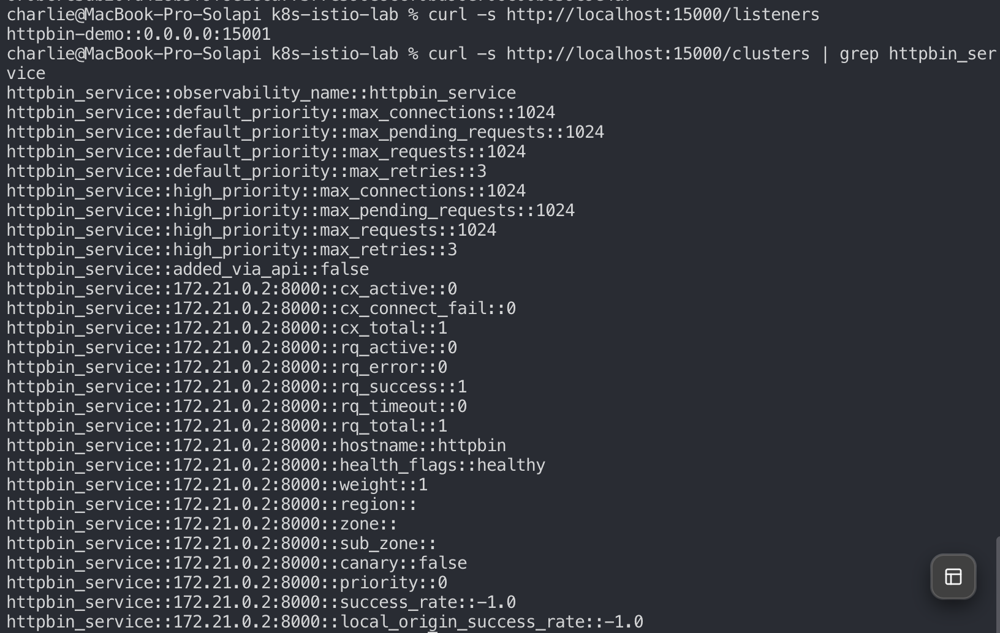

# 3 이스티오의 데이터 플레인: 엔보이 프록시

- 엔보이 프록시가 무엇이고 어떤 기능을 하는지
- 엔보이를 직접 도커로 띄워보고 Admin API로 들여다보기
- 엔보이의 요청 재시도(retry)를 눈으로 확인하기
- 엔보이가 이스티오에 어떻게 들어맞는지

> 데이터 플레인 = 엔보이(Envoy)들의 집합. 3장은 데이터 플레인을 이루는 **엔보이 하나만 떼어내서** 클러스터 없이 도커로 직접 돌려보는 장이다.
> (2장은 istio 전체를 설치했다면, 3장은 istio 안의 "근육 세포 하나"를 자세히 뜯어보는 셈)

## 3.1 엔보이 프록시란 무엇인가?

- 엔보이 : 오픈소스의 고성능 **L7(애플리케이션 계층) 프록시**. 리프트(Lyft)가 만들어 CNCF에 기증.
- 리버스 프록시처럼 **백엔드 토폴로지를 클라이언트에게 숨기고**, 로드 밸런싱하고, 장애 난 백엔드를 우회시킴.
- L3/L4 프록시(커넥션만 봄)와 달리 **HTTP 1.1 / HTTP2 / gRPC 등 애플리케이션 프로토콜을 이해** → 요청 수준 타임아웃·재시도·서킷 브레이커 같은 기능을 할 수 있음.
- MongoDB, DynamoDB, AMQP 같은 프로토콜용 필터로 **확장 가능**.
- 애플리케이션 **밖(외부 프로세스)** 에서 동작 → 어떤 언어/프레임워크로 작성됐든 상관없이 엔보이의 기능들을 씀. (라이브러리 시대와 대비되는 핵심)
- 다재다능: **에지 프록시**(진입점) / **공유 프록시** / **서비스별 프록시(사이드카)** 어디든 쓸 수 있음. 이스티오는 서비스 인스턴스당 하나씩 배포하는 방식을 택함.

### 3.1.1 엔보이의 핵심 기능

엔보이를 이해하려면 다음 3가지 개념을 알아야 함:

```bash
┌────────────┬──────────────────────────────────────────────────┐
│   개념     │                       뜻                         │
├────────────┼──────────────────────────────────────────────────┤
│ 리스너     │ 외부로 포트를 여는 귀. 예) 15001 포트로 들어오는  │
│ (Listener) │ 트래픽을 받음                                     │
├────────────┼──────────────────────────────────────────────────┤
│ 루트       │ 리스너로 들어온 걸 "어디로 보낼지" 규칙.          │
│ (Route)    │ 예) /catalog면 catalog 클러스터로                │
├────────────┼──────────────────────────────────────────────────┤
│ 클러스터   │ 트래픽을 실제로 보낼 업스트림 서비스 묶음.        │
│ (Cluster)  │ 예) catalog-v1, catalog-v2가 각각 클러스터        │
└────────────┴──────────────────────────────────────────────────┘
```

트래픽 흐름 방향(용어):

```bash
다운스트림(클라이언트) ──> [리스너] ──> [루트] ──> [클러스터] ──> 업스트림(실제 서비스)
                          트래픽이 엔보이를 거쳐 다운스트림 → 업스트림으로 흐른다
```

그 외 핵심 기능들:
- **서비스 디스커버리** : 전용 라이브러리(Eureka/Consul/주키퍼) 없이, 디스커버리 API에서 엔드포인트를 자동으로 찾음. (이스티오 컨트롤 플레인이 이 디스커버리 API를 구현)
- **로드 밸런싱** : 라운드로빈, 일관된 해싱(스티키) 등
- **헬스 체크** : 능동/수동으로 장애 난 백엔드 골라내 우회
- **복원력** : 타임아웃, 재시도, 서킷 브레이커, 격벽
- **관측성** : 모든 트래픽이 엔보이를 거치니까 요청 시간·처리량·오류율 텔레메트리를 자동 수집
- **보안** : mTLS로 서비스 간 통신 암호화

### 3.1.2 엔보이와 다른 프록시 비교

```bash
┌──────────────┬───────────────────┬────────────────────────────┐
│              │  nginx / HAProxy  │           Envoy            │
├──────────────┼───────────────────┼────────────────────────────┤
│ 설정 변경    │ reload 필요       │ xDS API로 무중단 동적 변경 │
├──────────────┼───────────────────┼────────────────────────────┤
│ HTTP2/gRPC   │ 제한적            │ 1급 지원                   │
├──────────────┼───────────────────┼────────────────────────────┤
│ 확장성       │ 모듈/Lua          │ 필터 체인 + WASM(14장)     │
├──────────────┼───────────────────┼────────────────────────────┤
│ 관측성       │ 기본 로그         │ 풍부한 통계/트레이스       │
└──────────────┴───────────────────┴────────────────────────────┘
```

> 핵심 차이 = **동적 설정**. nginx는 설정 바꾸면 reload 하지만, 엔보이는 xDS로 실시간·무중단으로 바뀐다. (그래서 파드가 수시로 생성·종료되는 쿠버네티스에 잘 맞는다)

## 3.2 엔보이 설정하기

### 3.2.1 정적 구성 (static)

- YAML 파일에 리스너/루트/클러스터를 **직접 작성해두는** 방식. 이번 3.3 실습이 정적 구성 방식이다.
- `ch3/simple.yaml` 요지 : "15001 리스너로 들어온 모든(`/`) 트래픽을 httpbin:8000 클러스터로 보내라"

```yaml
static_resources:
  listeners:
  - address: { socket_address: { address: 0.0.0.0, port_value: 15001 } }  # 리스너
    ...
        routes:
        - match: { prefix: "/" }              # 루트
          route: { cluster: httpbin_service }
  clusters:
    - name: httpbin_service                   # 클러스터
      load_assignment:
        ... address: httpbin, port_value: 8000   # 업스트림 = httpbin
```

### 3.2.2 동적 구성 (xDS)

- 리스너/루트/클러스터/엔드포인트를 **API로 실시간 받아오는** 방식. 이스티오가 실제로 쓰는 방식.
- xDS = "x Discovery Service"의 묶음:

```bash
┌─────┬──────────────────────────────────────────┐
│ LDS │ Listener Discovery — 리스너를 받아옴      │
│ RDS │ Route Discovery — 루트(라우팅 규칙)       │
│ CDS │ Cluster Discovery — 클러스터(업스트림)    │
│ EDS │ Endpoint Discovery — 클러스터 안 실제 IP  │
│ SDS │ Secret Discovery — 인증서(mTLS용)         │
└─────┴──────────────────────────────────────────┘
```

> 2장에서 본 "istiod가 사이드카한테 설정을 뿌린다"가 바로 이 xDS 메커니즘. istiod = xDS 서버, 엔보이 = xDS 클라이언트.

## 3.3 엔보이 인 액션 (직접 실행)

> 클러스터 없이 **도커로 엔보이 하나만** 띄워서 자세히 살펴보자. httpbin(테스트용 백엔드) + Envoy(프록시) + curl(클라이언트).

### 준비: 이미지 받고 httpbin 띄우기

```bash
docker pull envoyproxy/envoy:v1.19.0
docker pull citizenstig/httpbin
docker pull curlimages/curl

# 도커 네트워크 + httpbin(테스트용 백엔드) 시작
docker network create envoymesh
docker run -d --name httpbin --network envoymesh citizenstig/httpbin

# httpbin 정상 확인
docker run --rm --network envoymesh curlimages/curl -s -X GET http://httpbin:8000/headers
{
  "headers": {
    "Accept": "*/*",
    "Host": "httpbin:8000",
    "User-Agent": "curl/8.21.0"
  }
}
```

### 엔보이 프록시 띄우기 (simple.yaml)

```bash
docker run -d --name proxy --network envoymesh -p 15000:15000 -p 15001:15001 \
  -v ~/Desktop/work/book-source-code/ch3/simple.yaml:/etc/envoy/envoy.yaml \
  envoyproxy/envoy:v1.19.0

docker ps --format '{{.Names}}\t{{.Status}}\t{{.Ports}}'
proxy     Up   0.0.0.0:15000-15001->15000-15001/tcp
httpbin   Up   8000/tcp
```

### 프록시(15001)를 통해 호출 → 엔보이가 헤더를 추가함

```bash
docker run --rm --network envoymesh curlimages/curl -s http://proxy:15001/headers
{
  "headers": {
    "Accept": "*/*",
    "Host": "httpbin",
    "User-Agent": "curl/8.21.0",
    "X-Envoy-Expected-Rq-Timeout-Ms": "15000",   # ← 엔보이가 붙인 것!
    "X-Request-Id": "fc73c9ae-4bc2-47cc-91c1-e09356ddf3a4"  # ← 요청 추적용 ID
  }
}
```

> httpbin에 직접 붙였을 땐 없던 `X-Envoy-Expected-Rq-Timeout-Ms`(타임아웃 힌트 15초)랑 `X-Request-Id`(트레이싱용)가 생겼다. **엔보이를 통과했다는 증거.**

### 3.3.1 엔보이의 Admin API

엔보이는 `15000` 포트에 자기 자신을 들여다보는 관리 API를 열어둠.

```bash
# 사용 가능한 엔드포인트 목록
curl -s http://localhost:15000/help | grep -E "/stats|/clusters|/certs|/config_dump|/listeners"
  /certs: print certs on machine
  /clusters: upstream cluster status
  /config_dump: dump current Envoy configs (experimental)
  /listeners: print listener info
  /stats: print server stats
  /stats/prometheus: print server stats in prometheus format

# 현재 리스너 (simple.yaml대로 15001 하나)
curl -s http://localhost:15000/listeners
httpbin-demo::0.0.0.0:15001

# 클러스터(업스트림) 상태 — httpbin이 healthy
curl -s http://localhost:15000/clusters | grep httpbin_service
httpbin_service::172.21.0.2:8000::rq_total::1
httpbin_service::172.21.0.2:8000::health_flags::healthy
```

```bash
┌────────────────┬──────────────────────────────────┐
│   엔드포인트   │               용도               │
├────────────────┼──────────────────────────────────┤
│ /certs         │ 머신상의 인증서                  │
│ /clusters      │ 설정된 클러스터(업스트림) 상태   │
│ /config_dump   │ 엔보이 설정 전체 덤프            │
│ /listeners     │ 설정된 리스너                    │
│ /stats         │ 엔보이 통계                      │
│ /stats/prometheus │ 통계(프로메테우스 형식)       │
└────────────────┴──────────────────────────────────┘
```

### 3.3.2 엔보이 요청 재시도 (retry)

일부러 500을 내서 엔보이가 자동 재시도하는 걸 확인. `simple_retry.yaml`에는 루트에 재시도 정책이 붙어있음:

```yaml
route:
  cluster: httpbin_service
  retry_policy:          # ← simple.yaml엔 없던 부분
    retry_on: 5xx        # 5xx 나면
    num_retries: 3       # 3번까지 재시도
```

```bash
# 프록시를 재시도 설정으로 교체
docker rm -f proxy
docker run -d --name proxy --network envoymesh -p 15000:15000 -p 15001:15001 \
  -v ~/Desktop/work/book-source-code/ch3/simple_retry.yaml:/etc/envoy/envoy.yaml \
  envoyproxy/envoy:v1.19.0

# 일부러 500 경로 호출 (httpbin이 항상 500 반환)
docker run --rm --network envoymesh curlimages/curl -s -o /dev/null -w "응답코드: %{http_code}\n" \
  http://proxy:15001/status/500
응답코드: 500

# Admin API 통계로 재시도 횟수 확인
curl -s http://localhost:15000/stats | grep -E "upstream_rq_retry|upstream_rq_5xx"
cluster.httpbin_service.upstream_rq_5xx: 1          # 클라이언트가 본 실패는 1번
cluster.httpbin_service.retry.upstream_rq_5xx: 3    # 근데 재시도로 5xx가 3번 더
cluster.httpbin_service.upstream_rq_retry: 3        # ← 엔보이가 3번 재시도함!
cluster.httpbin_service.upstream_rq_retry_limit_exceeded: 1  # 3번 다 실패해서 포기
```

> **핵심:** 클라이언트는 요청 1번 보냈는데 엔보이가 뒤에서 **자동으로 3번 더 재시도**(`upstream_rq_retry: 3`)했다. httpbin이 항상 500이라 결국 500을 받았지만, 만약 **간헐적 실패**였다면 사용자는 실패를 못 느끼고 성공 응답을 받았을 것. → 앱 코드 수정 0줄로 복원력을 얻는다.

### 정리 (도커 정리)

```bash
docker rm -f httpbin proxy
docker network rm envoymesh
```

## 3.4 엔보이는 어떻게 이스티오에 맞는가?

```bash
┌──────────────────────────────────────────────────────────┐
│                     이스티오 = 두 조각                    │
├──────────────────────────────────────────────────────────┤
│  컨트롤 플레인 (istiod)   = xDS 서버                      │
│      │  LDS/RDS/CDS/EDS/SDS로 설정을 내려줌               │
│      ▼                                                    │
│  데이터 플레인 (엔보이들) = xDS 클라이언트                │
│      파드마다 하나씩, 실제 트래픽 처리                    │
└──────────────────────────────────────────────────────────┘
```

- 3장에서 도커로 띄운 엔보이는 **정적 설정(simple.yaml)** 이었지만, 이스티오 안의 엔보이는 **동적(xDS)** 으로 istiod한테 설정을 받음.
- 즉 우리가 2장에서 `VirtualService`/`DestinationRule` YAML을 적용하면 → istiod가 그걸 **엔보이용 리스너/루트/클러스터로 번역** → xDS로 각 사이드카에 배포하는 것.
- 그래서 사람은 쉬운 이스티오 리소스만 쓰고, 어려운 엔보이 설정은 istiod가 대신 만들어준다.

## 요약하자면
- [엔보이] 애플리케이션 밖에서 도는 L7 프록시. HTTP/gRPC 이해 → 재시도·타임아웃·관측성·mTLS 제공
- [3대 개념] 리스너(귀) → 루트(길안내) → 클러스터(목적지 서비스). 다운스트림 → 업스트림
- [정적 vs 동적] 정적=YAML 직접, 동적=xDS(LDS/RDS/CDS/EDS/SDS)로 실시간
- [Admin API] 15000 포트로 /stats·/clusters·/listeners 등 자기 상태 들여다보기
- [재시도] `retry_policy`로 5xx 자동 재시도 → `upstream_rq_retry` 통계로 확인
- [이스티오와의 관계] istiod=xDS 서버(설정 만듦), 엔보이=xDS 클라이언트(설정 받아 실행)


# 3장 실습

엔보이 프록시

① 백엔드(httpbin) 띄우기
```bash
docker network create envoymesh
docker run -d --name httpbin --network envoymesh citizenstig/httpbin
# 정상 확인
docker run --rm --network envoymesh curlimages/curl -s http://httpbin:8000/headers
```
② Envoy 프록시 띄우기 (simple.yaml)
```bash
docker run -d --name proxy --network envoymesh -p 15000:15000 -p 15001:15001 \
  -v ~/Desktop/work/book-source-code/ch3/simple.yaml:/etc/envoy/envoy.yaml \
  envoyproxy/envoy:v1.19.0
docker ps --format '{{.Names}}\t{{.Status}}'
```
③ 프록시(15001) 통과시키면 Envoy가 헤더를 붙임
```
docker run --rm --network envoymesh curlimages/curl -s http://proxy:15001/headers
→ httpbin 직접 호출(①)엔 없던 **X-Envoy-Expected-Rq-Timeout-Ms, X-Request-Id**가 생김. "Envoy를 통과했다는 증거." 
```

④ Admin API로 Envoy 속 들여다보기 (15000)
```bash
curl -s http://localhost:15000/listeners      # 리스너: httpbin-demo::0.0.0.0:15001
curl -s http://localhost:15000/clusters | grep httpbin_service   # 업스트림 상태(healthy)
```
⑤ retry 확인 (simple_retry.yaml로 교체) — 2장 retry랑 연결
```bash
docker rm -f proxy
docker run -d --name proxy --network envoymesh -p 15000:15000 -p 15001:15001 \
  -v ~/Desktop/work/book-source-code/ch3/simple_retry.yaml:/etc/envoy/envoy.yaml \
  envoyproxy/envoy:v1.19.0
# 일부러 500 내보기 → retry 통계 확인
docker run --rm --network envoymesh curlimages/curl -s http://proxy:15001/status/500
curl -s http://localhost:15000/stats | grep retry    # upstream_rq_retry 숫자 오름
```
⑥ 정리
```bash
docker rm -f proxy httpbin && docker network rm envoymesh
```

## 명령어 메모
```bash
① httpbin(테스트용 백엔드 서버) 띄우기

docker run -d --name httpbin --network envoymesh citizenstig/httpbin

┌─────────────────────┬───────────────────────────────────────────────────────┐
│        조각         │                          뜻                           │
├─────────────────────┼───────────────────────────────────────────────────────┤
│ docker run          │ 컨테이너 하나 실행                                    │
├─────────────────────┼───────────────────────────────────────────────────────┤
│ -d                  │ detached = 백그라운드로 (터미널 안 잡아먹고 뒤에서    │
│                     │ 계속 돌게)                                            │
├─────────────────────┼───────────────────────────────────────────────────────┤
│ --name httpbin      │ 이 컨테이너 이름을 httpbin으로 (나중에 이름으로       │
│                     │ 부르려고)                                             │
├─────────────────────┼───────────────────────────────────────────────────────┤
│ --network envoymesh │ 아까 만든 envoymesh 네트워크에 연결 (여기 붙은        │
│                     │ 애들끼리 이름으로 통신 가능)                          │
├─────────────────────┼───────────────────────────────────────────────────────┤
│ citizenstig/httpbin │ 사용할 이미지 = 아무 요청이나 받아서 그대로 돌려주는  │
│                     │ 테스트용 서버                                         │
└─────────────────────┴───────────────────────────────────────────────────────┘
```

찔러보기
```bash
charlie@MacBook-Pro-Solapi k8s-istio-lab % docker run --rm --network envoymesh curlimages/curl -s http://httpbin:8000/headers
{
  "headers": {
    "Accept": "*/*",
    "Host": "httpbin:8000",
    "User-Agent": "curl/8.21.0"
  }
}
```


```bash
charlie@MacBook-Pro-Solapi k8s-istio-lab % docker run -d --name proxy --network envoymesh -p 15000:15000 -p 15001:15001 \
  -v ~/Desktop/work/book-source-code/ch3/simple.yaml:/etc/envoy/envoy.yaml \
  envoyproxy/envoy:v1.19.0
670bc7c3db20fd418b5f9f8e1eca77377e596e8ccf0bd96e706c00b659c9e4a7
charlie@MacBook-Pro-Solapi k8s-istio-lab % curl -s http://localhost:15000/listeners # lisenter 조회
httpbin-demo::0.0.0.0:15001 # 데모로 돌고 있는 중
charlie@MacBook-Pro-Solapi k8s-istio-lab % curl -s http://localhost:15000/clusters | grep httpbin_service # 목적지(업스트림) 상태
httpbin_service::observability_name::httpbin_service
httpbin_service::default_priority::max_connections::1024
httpbin_service::default_priority::max_pending_requests::1024
httpbin_service::default_priority::max_requests::1024
httpbin_service::default_priority::max_retries::3
httpbin_service::high_priority::max_connections::1024
httpbin_service::high_priority::max_pending_requests::1024
httpbin_service::high_priority::max_requests::1024
httpbin_service::high_priority::max_retries::3 #  재시도 상한 3
httpbin_service::added_via_api::false
httpbin_service::172.21.0.2:8000::cx_active::0 #  172.21.0.2:8000 httpbin의 실제 주소, httpbin이라 썼는데 Envoy가 IP로 해석
httpbin_service::172.21.0.2:8000::cx_connect_fail::0
httpbin_service::172.21.0.2:8000::cx_total::1  # cx=connection 커넥션 1개
httpbin_service::172.21.0.2:8000::rq_active::0
httpbin_service::172.21.0.2:8000::rq_error::0
httpbin_service::172.21.0.2:8000::rq_success::1 # 요청 한 개 성공함
httpbin_service::172.21.0.2:8000::rq_timeout::0
httpbin_service::172.21.0.2:8000::rq_total::1 # 요청 한 개 보냈고
httpbin_service::172.21.0.2:8000::hostname::httpbin
httpbin_service::172.21.0.2:8000::health_flags::healthy # envoy가 헬스체크로 백엔드가 정상인걸 판단
httpbin_service::172.21.0.2:8000::weight::1
httpbin_service::172.21.0.2:8000::region::
httpbin_service::172.21.0.2:8000::zone::
httpbin_service::172.21.0.2:8000::sub_zone::
httpbin_service::172.21.0.2:8000::canary::false
httpbin_service::172.21.0.2:8000::priority::0
httpbin_service::172.21.0.2:8000::success_rate::-1.0 #  샘플 부족해 계산 안 됨 ? (정상)
httpbin_service::172.21.0.2:8000::local_origin_success_rate::-1.0
```

클러스터 상태
- 읽는 방법 ` 클러스터명::[엔드포인트IP]::지표::값`s